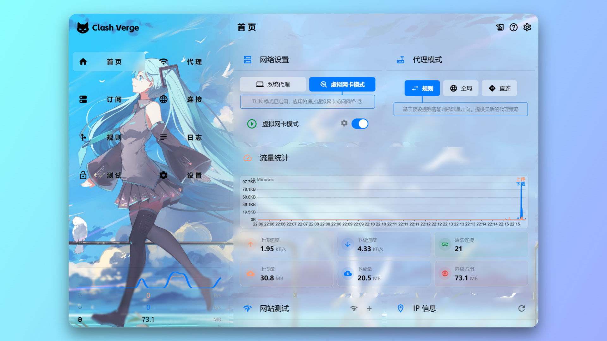
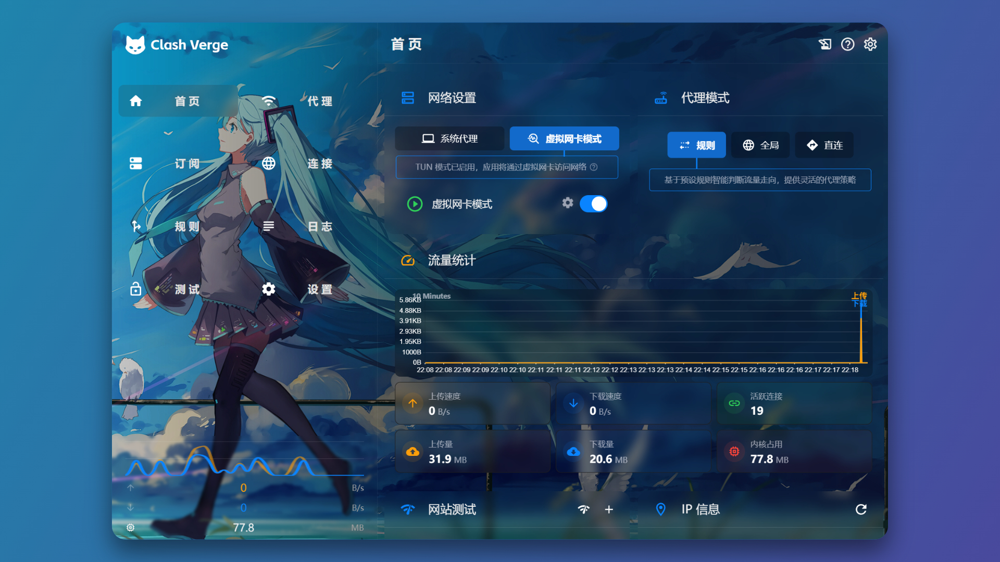

# 🌟 Clash Verge 初音未来透明 CSS 皮肤

📖 **English**: [README_EN](README_EN.md)

推荐使用最新版，请注意核对版本号。

## 📷 截图

## 📋 描述

一个为 Clash Verge 量身定制的透明初音未来 CSS 皮肤。为您的 Clash Verge 界面提供一个时尚现代的外观，透明、磨砂的设计中融合了初音未来的主题。

## ✨ 特点

- 透明 UI
- 完美支持深色/浅色模式
- 简单易用

## 🛠️ 安装步骤

1. 打开 Clash Verge 设置。
2. 进入主题设置。
3. 选择“编辑 CSS”。
4. 将此仓库中的 CSS 代码粘贴进输入框。
5. 保存并享受全新的初音未来主题界面。

## 🙏 致谢

本项目最初由 Duke486 创建，现已移交维护。这一栏仅用于记录并感谢他的原创与付出。

  
   
  <a href="https://github.com/Duke486">Duke486</a>

